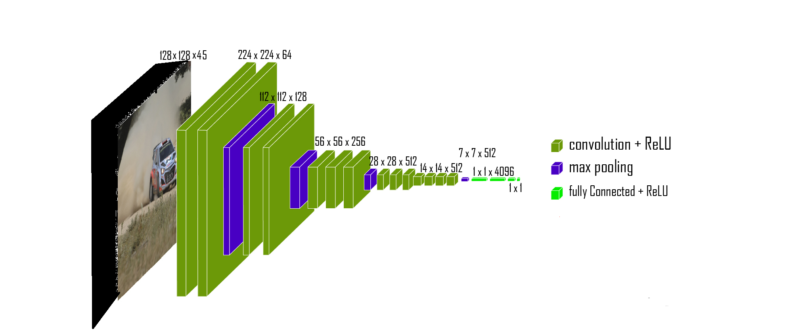

# Predicting IMDB score from movie’s trailer

 

In this project we attempt to use a Pre-trained model to predict from selected frames of a trailer, it's IMDB score.
We use Transfer-Learning by performing additional training on a pre-trained network, using the new dataset, to achieve this task.
The creation of this unique Dataset was made by scraping from the internet the trailers MP4 files and sampling frames from them.
This is a class project as part of EE046211 - Deep Learning course @ Technion.

    Eran Mann: <a href="https://github.com/EranMann1">GitHub</a>
   
    Ze'ev Zukerman:  <a href="https://github.com/Zeevzu">GitHub</a>
  

Link to the Drive with the Project - 

    <a href="https://drive.google.com/drive/folders/1ecvNFD-mHsSIs7fCg59mDQ6GgTRbyr9m?usp=share_link">Project Drive</a>

## Agenda
  * [Background](#Background)  
  * [Dataset](#Dataset)  
  * [Model](#Model)  
  * [Training and Results](#Training%20and%20Results)
  * [Files in the repository](#Files%20in%20the%20repository)

## Background

As mentioned previously, the goal of the project is to obtain the IMDB score of a movie, based on it's trailer, As showed in the following block diagram.

 

The main constraints we made for this project is reasonable traning and inference time. Those constraints guided us to be more creative with the input of our model.
To have reasonable traning and inference time we used a pre-trained DNN model, also we assumed that video as an input will cause a huge input layer with big redundancy between following frames, as result we chose to sample randomly meaningful frames from the trailer and to have small amount of frames as the input to the model. So the actuall block diagram of our project is as follows.

 

## Dataset

## Model
As mentioned in the Background section, We worked with pre-trained Deep Neural Networks. The architectures we chose were - Resnet50, Resnet18 and VGG16. To all of those models we updated the input layer and the first 2D convolution layer to get 15 input channels. Also we added a linear output layer with 1 output because we use the network for regression task.
As we can see in the next section, the architecture which achieved the best results was the VGG16, with the following updated architecture as showed below.

 

